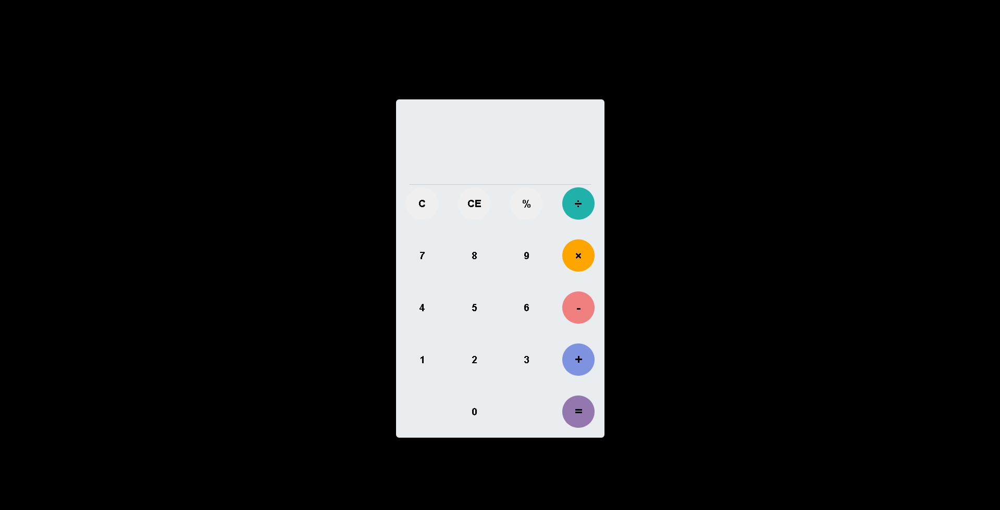

<!-- Top Image and Title -->

	
	<h1>Calculadora Simples</h1>
	<!-- Subtitle/Description -->
	<h4>A calculadora realiza os cálculos com as operações: ADIÇÃO, SUBTRAÇÃO, DIVISÃO e MULTIPLICAÇÃO</h4>

<!-- Nav Menu -->

	<a  href=#telescope-tecnologias>Technologies</a>  

### :telescope: Technologies

- [HTML5](https://developer.mozilla.org/pt-BR/docs/Web/HTML)

- [CSS3](https://developer.mozilla.org/pt-BR/docs/Web/CSS)

- [JAVASCRIPT](https://developer.mozilla.org/pt-BR/docs/Web/JavaScript)
